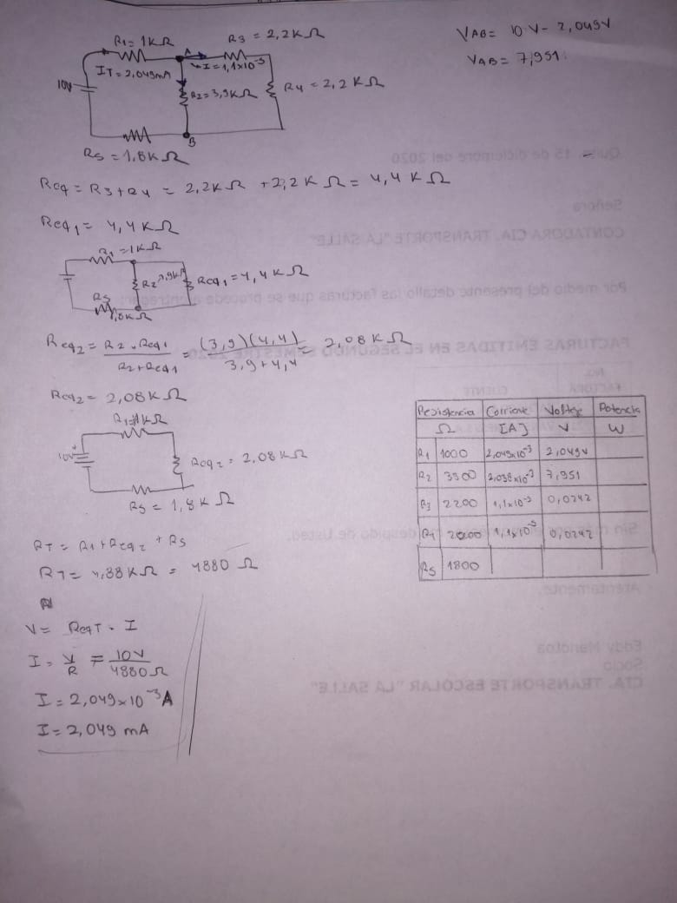

# Informe
1.OBJETIVOS 

•	Describir las características de las ramas, los nodos y los lazos de un circuito. Inferir las Leyes de Kirchhoff en base a los resultados experimentales de la simulación. 

• A través de las Leyes de Kirchhoff	calcular los valores teóricos de las intensidades de corriente y los voltajes en un circuito específico.  

• Usar de igual forma la Ley de Ohm para el cálculo matemático de corrientes y tensiones.

•	Explicar cómo las leyes de Kirchhoff son consecuencia de la conservación de la carga y la energía.

•	Comparar los resultados teóricos hallados mediante el cálculo y los experimentales usando equipos de medición (simulados) y determinar el error porcentual presente entre ellos.

2.MARCO TEÓRICO

Las leyes de voltajes y corrientes de Kirchhoff cuyas abreviaciones son LVK y LCK respectivamente, son dos igualdades que se basan en el principio de conservación de la energía y en la carga de los circuitos eléctricos. La ley de voltaje de Kirchhoff establece que la suma algebraica de las caídas de voltaje en una secuencia cerrada de nodos es igual a la suma de las elevaciones de voltaje de la misma. De igual manera la ley de corriente de Kirchhoff establece que la corriente entrante a un nodo es igual a la suma de las corrientes salientes.

3. DIAGRAMAS

*Diagrama Sistemático:* 

*Diagrama medición de Amperaje:*

*Diagrama medición de Voltaje:*

4. LISTA DE COMPONENTES

5. EXPLICACIÓN 

A modo de una explicación clara se tomará en cuenta el flujo de electrones desde el lado positivo de la fuente de voltaje, hacia el lado negativo de la misma. El circuito eléctrico siempre tiene el mismo funcionamiento, ya sea simple o complejo. 

El voltaje, la tensión o diferencia de potencial que suministra la fuente de alimentación al circuito se caracteriza por tener su valor fijo (10 V). En dependencia de la mayor o menor resistencia en ohmios que encuentre el flujo de corriente de electrones al recorrer el circuito, así será su intensidad en amperios. Al inicio nos encontramos con una resistencia de 1kohm. 

Una vez que la corriente de electrones logra vencer la primera resistencia (1 kohm) y las posteriores, la corriente eléctrica retorna a la fuente de fuerza electromotriz por su polo negativo. El flujo de corriente eléctrica o de electrones se mantendrá circulando por el circuito hasta tanto no se accione el interruptor que permite detenerlo, en este caso, al detneer la simulación. La resistencia eléctrica tiene la función de oponerse al paso de corriente eléctrica en el circuito. Esta característica de oposición al paso de la corriente eléctrica, produce una serie de efectos de los cuales podemos ser testigos. Efectos como la caída de tensión (divisor de tensión) o establecer la corriente que va a circular por una rama poniendo una resistencia u otra en paralalelo.   

*Resultados obtenidos de voltaje y corriente, en cada elemento del circuito:*
 
 _Tabla 1.1. Resultados obtenidos de voltaje y corriente, en cada elemento del circuito: 
 
 

_Tabla 1.2. Verificación de la LVK:

_Tabla 1.3. Verificación de la LCK:

6. CONCLUSIONES:

• Los errores presentes en el análisis de las dos leyes de Kirchhoff se originan debido a la toma de valores del simulador, los cuales ocupan menos cifras decimales, esto en un modo práctico no es recomendable hacer. Por otro lado, para los valores calculados se tomaron en cuenta más cifras significativas y nos arrojaron un valor más aproximado a la realidad. Siendo causa generadora del error porcentual en el laboratorio. 

7. BIBLIOGRAFÍA

•Ruíz Vázquez, T., Fraile, J., Nilsson, J. W., & Riedel, S. (2004). Análisis básico de circuitos eléctricos y electrónicos. Universitario, 76.

•AlaYoable. (2010). Electricidad: conceptos básicos. [Video]. Recuperado de: https://youtu.be/ElB3GrL4eCY. 

•IngeDarwin. (2019). LEY DE KIRCHHOFF (MALLAS) / EJERCICIO 1 [Video]. Recuperado de: https://www.youtube.com/watch?v=1NC9kGDn7Bg

8. ANEXOS

